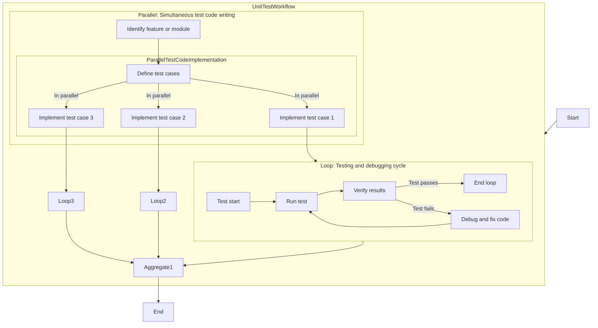
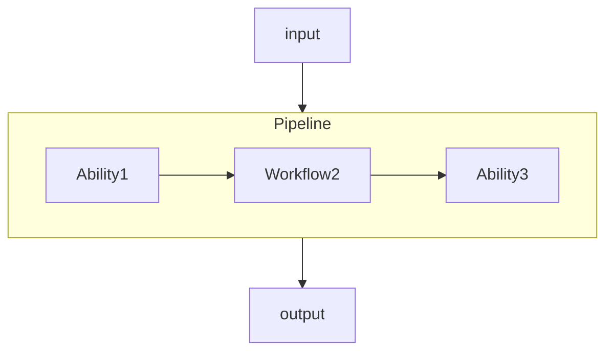
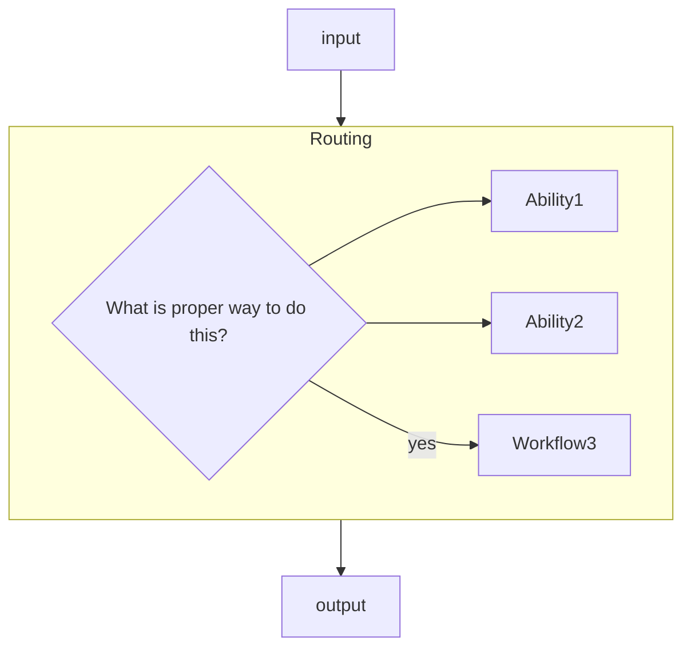
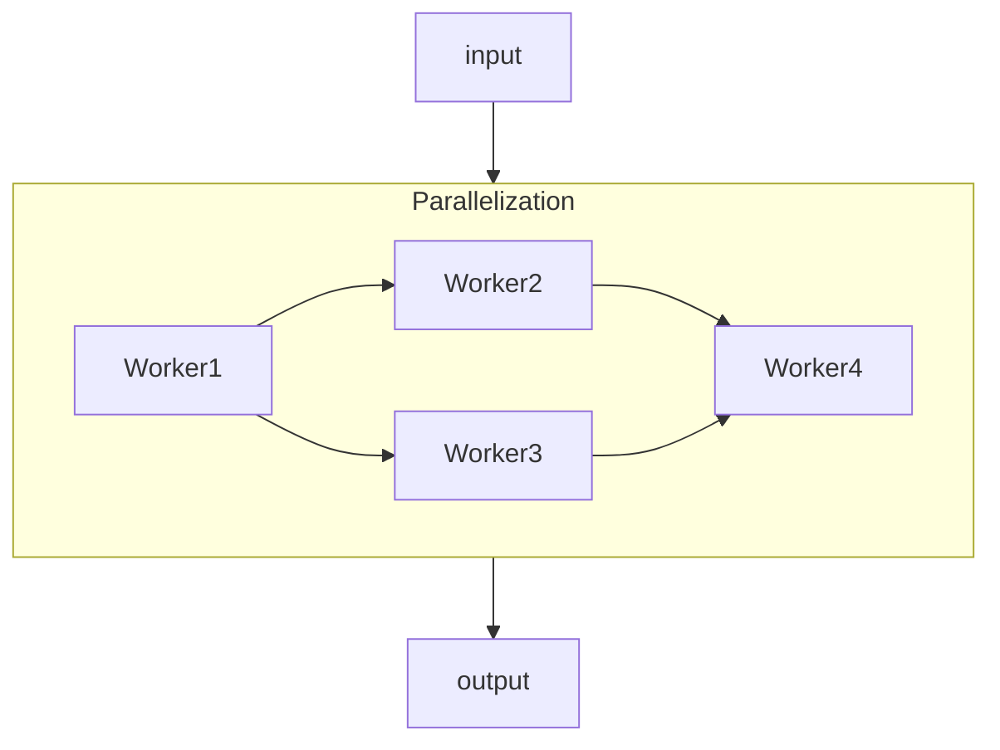
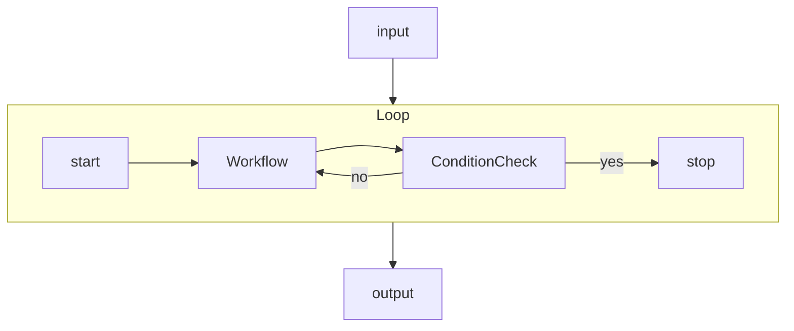

# Workflow

Workflow is a step-by-step process to accomplish a goal.
It composes multiple abilities or other workflows.

This is example of unit test workflow.

## Pipeline

Pipeline is a workflow that Jarvis uses to execute a Pipeline of abilities in order.

Pipeline contain multiple abilities or workflows.

## Router

Router is a workflow that Jarvis uses to route a request to the appropriate ability.

## Parallelization

Parallelization is a workflow that Jarvis uses to orchestrate multiple workers to accomplish a goal.

## Loop

Loop is a workflow that Jarvis uses to loop a Pipeline of abilities until a condition is met.

